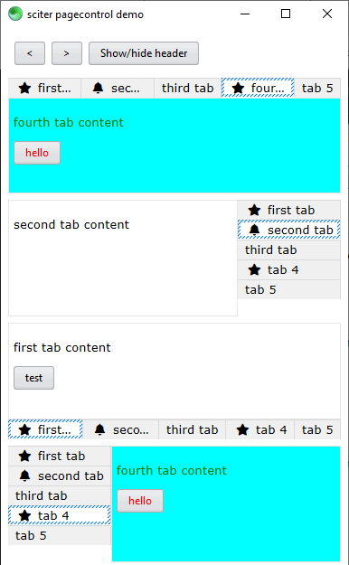

# sciter pagecontrol

This is a [sciter.js](https://sciter.com/) pagecontrol component.

## get started

- git clone the repository
- run `install.bat` to download the latest sciter binaries and library
- start `scapp.exe`
- to refresh the app after changes to the html/css click `F5`

## debug app

- start `inspector.exe`
- inside the `scapp.exe` window click `CTRL + SHIFT + I` to connect to the inspector
- click `CTRL + SHIFT + left click` to inspect an element
- note: the clock component forces the DOM to refresh every second, remove the component if you want to inspect in peace.
